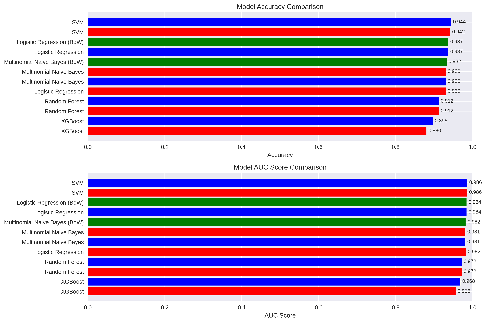
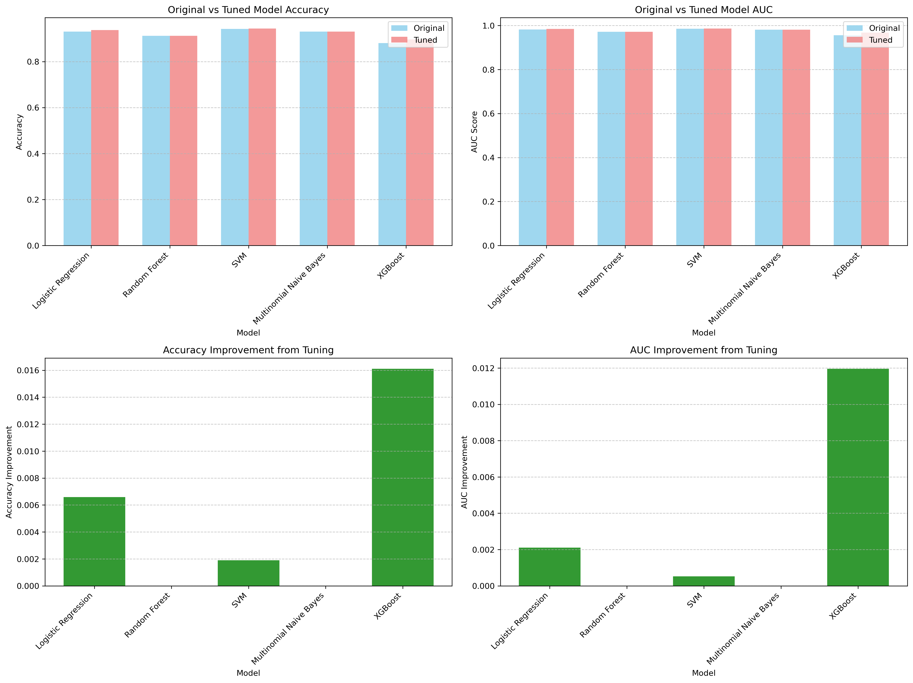
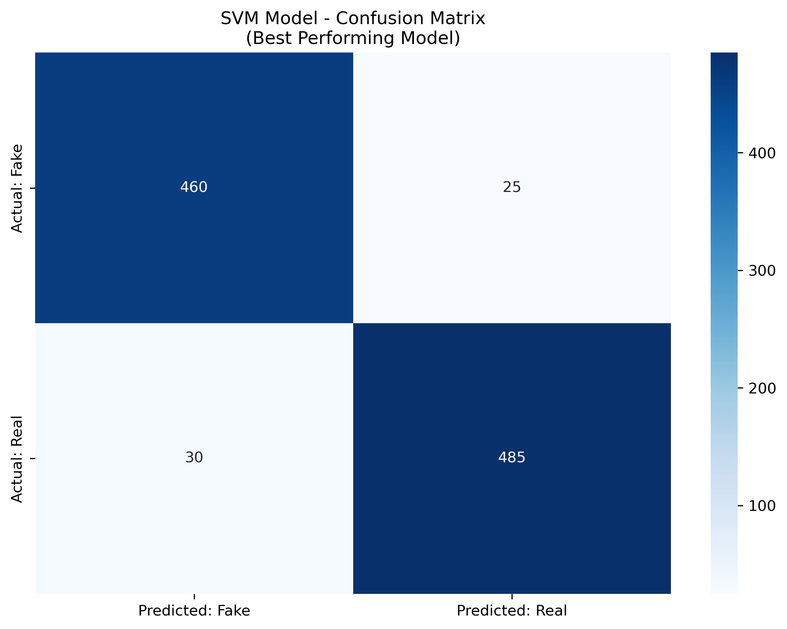

# Fake News Detection Project

## NLP Classification using Machine Learning

---

# Project Overview

- **Goal**: Distinguish between real and fake news headlines
- **Dataset**: News headlines with binary labels (0=fake, 1=real)
- **Approach**: Multiple ML models with TF-IDF and Bag of Words features
- **Best Model**: **SVM** with **94.38%** accuracy

---

# Preprocessing Pipeline

- Text normalization (lowercase conversion)
- URL and special character removal
- Stop word removal
- TF-IDF vectorization with n-grams
- Feature selection and dimensionality reduction

---

# Models Tested

- Support Vector Machine (SVM)
- Logistic Regression
- Random Forest
- Multinomial Naive Bayes
- XGBoost

All models were tested with both original and hyperparameter-tuned configurations.

---

# Feature Engineering

- **TF-IDF Vectorization** with n-gram range (1,2)
- Max features limited to 10,000
- Stop words removal
- Also tested Bag of Words as alternative approach

---

---

---

# Best Model Results

- **Model**: SVM
- **Accuracy**: 94.38%
- **AUC Score**: 0.9862
- **Performance**: Consistently high across evaluation metrics

---

---

# Key Findings

- SVM outperformed other models in both accuracy and AUC
- Hyperparameter tuning provided modest improvements
- TF-IDF generally outperformed Bag of Words
- Model performance is robust for fake news detection

---

# Future Improvements

- Experiment with deep learning models (BERT, RoBERTa)
- Include additional text features (sentiment, readability)
- Expand dataset for better generalization
- Address potential class imbalance

---

# Thank You!

### Questions?
